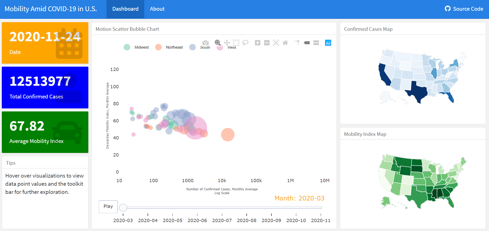

# COVID-Mobility-Dashboard

The objective of this dashboard application is to monitor mobility and COVID-19 development in the United States.

Please access the dashboard at <https://sparklingjourney.github.io/COVID-Mobility-Dashboard/>.

More information could be found in the 'About' page of the dashboard app.

The index.Rmd file contains codes for the app which sources codes from the DataProcessing.R file.

